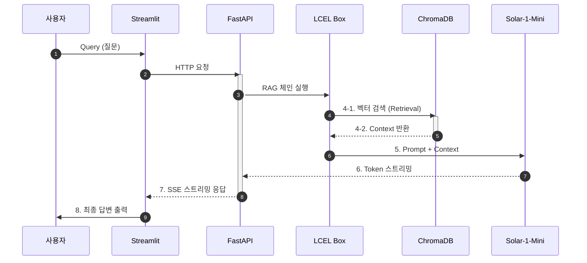

#  LangChain 기술 문서 RAG 챗봇

> **프로젝트 목표:** LangChain 기술 문서를 기반으로 정확하고 신뢰성 높은 답변을 제공하는 **검색 증강 생성(RAG)** 챗봇 시스템입니다. **LCEL(LangChain Expression Language)**을 활용한 모듈화된 파이프라인 구축 및 Docker Compose 기반의 완벽한 컨테이너 배포 환경을 구현했습니다.

---

## 0. Overview (프로젝트 개요)

| 항목 | 상세 내용 |
| :--- | :--- |
| **주요 목표** | Upstage Solar LLM을 백본으로 하는 **엔드-투-엔드(End-to-End) RAG 서비스** 구축. |
| **핵심 성과** | 1. **LCEL 기반 RAG 파이프라인** 설계 및 비동기 스트리밍 구현. <br> 2. **Docker Compose**를 활용한 견고한 다중 서비스 배포 환경 구축. <br> 3. **고품질 테스트 코드**(`pytest`)로 핵심 RAG 동작 및 LLM 연결 검증. |
| **아키텍처** | **Streamlit** (UI) ↔ **FastAPI** (API) ↔ **RAGRetriever** (LCEL) ↔ **ChromaDB** (VDB) |
| **LLM / 임베딩** | **Solar-1-Mini** (LLM), **Solar Embedding-1-Large** (Embedding) |
| **데이터셋** | LangChain 공식 기술 문서 (Web Crawler를 통해 수집) |

### 🛠️ 환경 및 요구 사항

| 항목 | 상세 내용 |
| :--- | :--- |
| **OS** | Ubuntu (Docker 환경) |
| **Python** | 3.10+ |
| **프레임워크** | FastAPI, Streamlit, LangChain, Pytest |
| **DB / Infra** | ChromaDB (Docker Compose), Docker |

---

## 1. 아키텍처 및 기술적 결정 (Technical Deep Dive)


### 1.1. 시스템 아키텍처 다이어그램


이 프로젝트는 LangChain LCEL 기반의 RAG 챗봇 시스템이며, Docker Compose 환경에서 모듈화되어 운영됩니다. 특히, 사용자의 응답 체감 속도를 극대화하기 위해 스트리밍 아키텍처를 채택했습니다.


### 핵심 상호작용 (Sequence Diagram 요약)

1. 시작: 사용자의 질문은 **Streamlit (UI)**을 거쳐 **FastAPI (API)**로 전달됩니다.

2. RAG 실행: FastAPI 내부에서 LangChain LCEL 파이프라인이 실행되어 ChromaDB로부터 관련 문서를 검색합니다.

3. 생성 및 스트리밍: 검색된 Context를 포함한 Prompt가 Solar-1-Mini LLM에 전달되며, LLM이 생성하는 답변 토큰은 FastAPI를 통해 SSE(Server-Sent Events) 방식으로 Streamlit에 실시간으로 전송됩니다.

4. 최종 출력: Streamlit은 토큰을 즉시 사용자에게 출력하여 지연 시간을 최소화합니다.


### LCEL RAG 체인 흐름 다이어그램
```mermaid
graph TD
    %% -------------------------------------
    %% A. 노드 정의 및 흐름 연결
    %% -------------------------------------
    A([1. Query (User Input)]) --> B(2. Retriever - ChromaDB);
    B --> C{3. Documents (검색된 문서)}: 유사 문서 반환;
    C --> D(4. Prompt Template): Context 제공;
    D --> E[(5. LLM - Solar-1-Mini)]: 최종 Prompt 구성;
    E --> F(6. Output Parser): 원본 답변 생성;
    F --> G([7. Final Answer]): 출처 분리 및 최종 정리;

    %% -------------------------------------
    %% B. 스타일 (기술 강조) - 색상 코드를 단순화하여 오류 방지
    %% -------------------------------------
    style A fill:#ffdddd, stroke:#c0392b
    style G fill:#ffdddd, stroke:#c0392b
    style B fill:#d0f0d0, stroke:#27ae60
    style E fill:#fff8e1, stroke:#f39c12
    style D fill:#aed6f1, stroke:#3498db
```


### Docker Compose 서비스 구성도


## 2. 🐳 Docker Compose 서비스 구성도 


```markdown
```mermaid
graph LR
    %% -------------------------------------
    %% A. 노드 정의 (컨테이너)
    %% -------------------------------------
    STR[Streamlit Container (UI: 8501)]
    API[FastAPI Container (API: 8000)]
    DB[(ChromaDB Container)]

    %% -------------------------------------
    %% B. 통신 흐름 연결
    %% -------------------------------------
    STR -- "HTTP 요청 (8501 -> 8000)" --> API;
    API -- "내부 요청" --> DB;
    API -.-> STR: "SSE 응답";

    %% -------------------------------------
    %% C. 스타일 (Docker 강조)
    %% -------------------------------------
    style STR fill:#e0f7fa,stroke:#00bcd4
    style API fill:#e0f7fa,stroke:#00bcd4
    style DB fill:#e8f5e9,stroke:#4caf50,stroke-dasharray: 5,5
```


---


### 1.2. 핵심 기술적 결정 및 문제 해결

| 영역 | 결정 사항 | 기술적 이점 (왜 이 방법을 선택했는가?) |
| :--- | :--- | :--- |
| **RAG 파이프라인** | **LCEL (LangChain Expression Language) 채택** | 파이프라인의 **모듈성**과 **재사용성**을 극대화. 비동기(`astream`) 및 병렬 처리를 쉽게 구현하여 LLM 애플리케이션의 **처리량(Throughput)**을 높임. |
| **UX/성능** | **FastAPI 스트리밍 구현** | `StreamingResponse`와 `astream`을 통해 답변을 실시간으로 전송. 사용자에게 응답 대기 시간을 느끼지 않게 하여 **사용자 경험(UX)**을 대폭 향상했습니다. |
| **문서 분할** | **Custom Chunking (코드 블록 보존)** | 기술 문서의 특성을 고려하여, 마크다운 코드 블록 내부의 텍스트가 분할되지 않도록 **커스텀 텍스트 분할기**를 구현하여 **검색 정확도**를 개선했습니다. |
| **배포/견고성** | **Docker Compose + Health Check** | 백엔드와 DB를 독립적인 서비스로 분리하고, `healthcheck`를 도입하여 **서비스 간 의존성**을 명확히 하고 안정적인 시작 순서를 강제했습니다. |

---

## 2. 프로젝트 구조 (Project Structure)

### 2.1. 프로젝트 디렉토리 구조

프로젝트는 모듈화, 가독성, 그리고 **PEP 표준** 준수를 위해 명확한 계층 구조로 설계되었습니다.

```bash
.
├── .github/
│   ├── ISSUE_TEMPLATE         # 이슈 템플릿
│   ├── experiment-report.md
│   ├── meeting-notes.md
│   ├── todo-list.md
│   └── trouble-shooting.md
│   └── workflows/
│       └── ci.yml             # 지속적 통합(CI) 파이프라인
├── data/
│   └── raw/
├── tests/                     # 통합 및 단위 테스트 코드
│   ├── test_llm.py            # LLM 관련 테스트
│   ├── test_questions.json    # 테스트 질문 데이터
│   └── test_retriever.py      # Retriever/RAG 핵심 테스트
├── docs/                      # 프로젝트 문서
│   └── FILE_LIST.md
├── src/                       # 핵심 애플리케이션 소스 코드
│   ├── modules/
│   │   ├── evaluation.py      # RAG 평가 로직
│   │   ├── llm.py             # Solar-1-Mini 모델 연동
│   │   ├── prompts.py         # 커스텀 프롬프트 템플릿
│   │   ├── retriever.py       # LangChain LCEL RAG 파이프라인 정의 (RAG의 핵심)
│   │   └── vector_database.py # ChromaDB 연결 및 관리
│   ├── utils/
│   │   ├── chunking_strategy.py
│   │   └── data_collector.py
│   ├── demo.py
│   ├── main.py                # FastAPI 애플리케이션 진입점
│   └── streamlit_app.py       # Streamlit UI 실행 및 API 연동
├── vectorstore/               # ChromaDB 벡터 데이터 저장소
├── .env.example
├── .gitignore
├── docker-compose.yml         # FastAPI, Streamlit, ChromaDB 통합 배포 설정
├── Dockerfile                 # FastAPI 이미지 빌드 파일
├── initialize_vector_db.py    # 초기 문서 인덱싱 실행 스크립트
├── requirements.txt           # Python 종속성 목록
├── README.md
└── start_api.py               # API 서버 시작 스크립트
```


---

## 3. 시작하기 (Quick Start Guide)

### 3.1. 환경 설정

1.  프로젝트 루트 경로에 `.env` 파일을 생성하고 **Upstage API Key**를 추가합니다.

    ```bash
    # .env
    UPSTAGE_API_KEY=YOUR_API_KEY_HERE
    FASTAPI_URL=http://localhost:8000
    CHROMA_HOST=chromadb # Docker 내부 통신용
    CHROMA_PORT=8000
    ```

2.  **Docker**와 **Docker Compose**가 설치되어 있는지 확인합니다.

### 3.2. 프로젝트 빌드 및 실행

```bash
# 1. Docker 컨테이너 빌드 및 실행
docker-compose up --build -d
```

3.3. 벡터 DB 초기화 및 문서 적재
컨테이너가 실행된 후, 기술 문서를 크롤링하고 벡터 데이터베이스에 적재하는 스크립트를 실행해야 합니다.


# Docker 컨테이너 내부에서 스크립트 실행
# (--reset: 기존 DB 삭제 후 재시작, --max-pages: 크롤링할 최대 페이지 수 제한)

docker exec -it fastapi-rag-api python initialize_vector_db.py --reset --max-pages 100
#  참고: --max-pages 0으로 설정하면 전체 문서를 크롤링합니다.


3.4. 접속 정보
서비스,URL
RAG 챗봇 UI (Streamlit),http://localhost:8501
FastAPI 문서 (Swagger UI),http://localhost:8000/docs


4. 테스트 및 견고성 증명프로젝트의 견고함은 Pytest를 통해 검증되었습니다.

4.1. 테스트 실행
Bash
# FastAPI 컨테이너 내부에서 Pytest 실행
docker exec fastapi-rag-api pytest tests/

4.2. 테스트 커버리지

테스트 파일테스트 종류주요 검증 내용tests/test_llm.py유닛 테스트LLM 연결, 모델 이름, API 인증 및 간단한 쿼리 응답 성공 여부 확인.tests/test_retriever.py통합 테스트ChromaDB 연결, 검색 정확도, LCEL RAG 체인의 동작 및 환각(Hallucination) 방지 로직 검증.


5. 유지보수 및 확장성 (Maintenance & Scalability)

독립적인 서비스: 모든 구성 요소가 Docker 컨테이너로 분리되어 있어, LLM 모델 교체나 벡터 DB(예: Pinecone, Weaviate) 교체가 용이합니다.

배포 안정성: docker-compose.yml의 healthcheck 설정은 서비스가 **완벽히 준비(Ready)**된 후에 다음 서비스가 시작되도록 보장하여, 배포 시의 의존성 오류를 방지합니다.


6. 참고 자료

LangChain Expression Language (LCEL) 공식 문서
Upstage Solar LLM API 및 임베딩 모델 가이드
FastAPI 및 Streamlit 공식 문서


